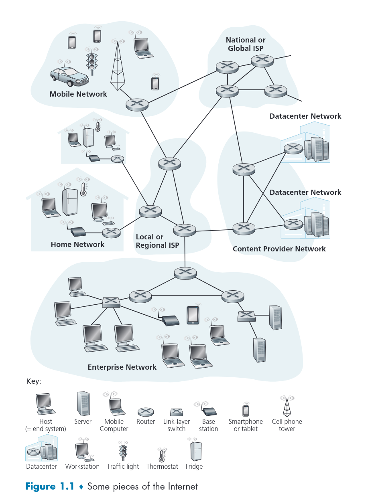
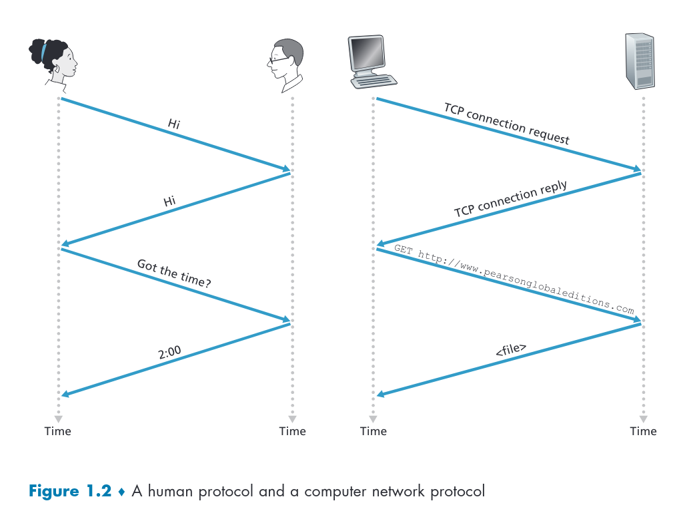

# Computer Networks and the Internet
- Today’s Internet is arguably the largest engineered system ever created by mankind, with hundreds of millions of connected computers, communication links, and switches; with billions of users who connect via laptops, tablets, and smartphones; and with an array of new Internet-connected “things” including game consoles, surveillance systems, watches, eye glasses, thermostats, body scales, and cars. Given that the Internet is so large and has so many diverse components and uses, is there any hope of understanding how it works? Are there guiding principles and structure that can provide a foundation for understanding such an amazingly large and complex system? And if so, is it possible that it actually could be both interesting and fun to learn about computer networks? Fortunately, the answer to all of these questions is a resounding YES! Indeed, it’s our aim in this book to provide you with a modern introduction to the dynamic field of computer networking, giving you the principles and practical insights you’ll need to understand not only today’s networks, but tomorrow’s as well.
- This first chapter presents a broad overview of computer networking and the Internet. Our goal here is to paint a broad picture and set the context for the rest of this book, to see the forest through the trees. We’ll cover a lot of ground in this introductory chapter and discuss a lot of the pieces of a computer network, without losing sight of the big picture.
- We’ll structure our overview of computer networks in this chapter as follows. After introducing some basic terminology and concepts, we’ll first examine the basic hardware and software components that make up a network. We’ll begin at the network’s edge and look at the end systems and network applications running in the network. We’ll then explore the core of a computer network, examining the links and the switches that transport data, as well as the access networks and physical media that connect end systems to the network core. We’ll learn that the Internet is a network of networks, and we’ll learn how these networks connect with each other.
- After having completed this overview of the edge and core of a computer network, we’ll take the broader and more abstract view in the second half of this chapter. We’ll examine delay, loss, and throughput of data in a computer network and provide simple quantitative models for end-to-end throughput and delay: models that take into account transmission, propagation, and queuing delays. We’ll then introduce some of the key architectural principles in computer networking, namely, protocol layering and service models. We’ll also learn that computer networks are vulnerable to many different types of attacks; we’ll survey some of these attacks and consider how computer networks can be made more secure. Finally, we’ll close this chapter with a brief history of computer networking.

## 1.1 What Is the Internet?
- In this book, we’ll use the public Internet, a specific computer network, as our principal vehicle for discussing computer networks and their protocols. But what is the Internet? There are a couple of ways to answer this question. First, we can describe the nuts and bolts of the Internet, that is, the basic hardware and software components that make up the Internet. Second, we can describe the Internet in terms of a networking infrastructure that provides services to distributed applications. Let’s begin with the nuts-and-bolts description, using Figure 1.1 to illustrate our discussion.

### 1.1.1 A Nuts-and-Bolts Description
- The Internet is a computer network that interconnects billions of computing devices throughout the world. Not too long ago, these computing devices were primarily traditional desktop PCs, Linux workstations, and so-called servers that store and transmit information such as Web pages and e-mail messages. Increasingly, however, nontraditional Internet “things” such as laptops, smartphones, tablets, TVs, gaming consoles, thermostats, home security systems, home appliances, watches, eye glasses, cars, traffic control systems and more are being connected to the Internet. Indeed, the term computer network is beginning to sound a bit dated, given the many nontraditional devices that are being hooked up to the Internet. In Internet jargon, all of these devices are called hosts or end systems. By some estimates, in 2015 there were about 5 billion devices connected to the Internet, and the number will reach 25 billion by 2020 [Gartner 2014]. It is estimated that in 2015 there were over 3.2 billion Internet users worldwide, approximately 40% of the world population [ITU 2015].

- End systems are connected together by a network of communication links and packet switches. We’ll see in Section 1.2 that there are many types of communication links, which are made up of different types of physical media, including coaxial cable, copper wire, optical fiber, and radio spectrum. Different links can transmit data at different rates, with the transmission rate of a link measured in bits/second. When one end system has data to send to another end system, the sending end system segments the data and adds header bytes to each segment. The resulting packages of information, known as packets in the jargon of computer networks, are then sent through the network to the destination end system, where they are reassembled into the original data.
- A packet switch takes a packet arriving on one of its incoming communication links and forwards that packet on one of its outgoing communication links. Packet switches come in many shapes and flavors, but the two most prominent types in today’s Internet are routers and link-layer switches. Both types of switches forward packets toward their ultimate destinations. Link-layer switches are typically used in access networks, while routers are typically used in the network core. The sequence of communication links and packet switches traversed by a packet from the sending end system to the receiving end system is known as a route or path through the network. Cisco predicts annual global IP traffic will pass the zettabyte (1021 bytes) threshold by the end of 2016, and will reach 2 zettabytes per year by 2019 [Cisco VNI 2015].
- Packet-switched networks (which transport packets) are in many ways similar to transportation networks of highways, roads, and intersections (which transport vehicles). Consider, for example, a factory that needs to move a large amount of cargo to some destination warehouse located thousands of kilometers away. At the factory, the cargo is segmented and loaded into a fleet of trucks. Each of the trucks then independently travels through the network of highways, roads, and intersections to the destination warehouse. At the destination warehouse, the cargo is unloaded and grouped with the rest of the cargo arriving from the same shipment. Thus, in many ways, packets are analogous to trucks, communication links are analogous to highways and roads, packet switches are analogous to intersections, and end systems are analogous to buildings. Just as a truck takes a path through the transportation network, a packet takes a path through a computer network.
- End systems access the Internet through Internet Service Providers (ISPs), including residential ISPs such as local cable or telephone companies; corporate ISPs; university ISPs; ISPs that provide WiFi access in airports, hotels, coffee shops, and other public places; and cellular data ISPs, providing mobile access to our smartphones and other devices. Each ISP is in itself a network of packet switches and communication links. ISPs provide a variety of types of network access to the end systems, including residential broadband access such as cable modem or DSL, high-speed local area network access, and mobile wireless access. ISPs also provide Internet access to content providers, connecting Web sites and video servers directly to the Internet. The Internet is all about connecting end systems to each other, so the ISPs that provide access to end systems must also be interconnected. These lowertier ISPs are interconnected through national and international upper-tier ISPs such as Level 3 Communications, AT&T, Sprint, and NTT. An upper-tier ISP consists of high-speed routers interconnected with high-speed fiber-optic links. Each ISP network, whether upper-tier or lower-tier, is managed independently, runs the IP protocol (see below), and conforms to certain naming and address conventions. We’ll examine ISPs and their interconnection more closely in Section 1.3.
- End systems, packet switches, and other pieces of the Internet run protocols that control the sending and receiving of information within the Internet. The Transmission Control Protocol (TCP) and the Internet Protocol (IP) are two of the most important protocols in the Internet. The IP protocol specifies the format of the packets that are sent and received among routers and end systems. The Internet’s principal protocols are collectively known as TCP/IP. We’ll begin looking into protocols in this introductory chapter. But that’s just a start—much of this book is concerned with computer network protocols!
- Given the importance of protocols to the Internet, it’s important that everyone agree on what each and every protocol does, so that people can create systems and products that interoperate. This is where standards come into play. Internet standards are developed by the Internet Engineering Task Force (IETF) [IETF 2016]. The IETF standards documents are called requests for comments (RFCs). RFCs started out as general requests for comments (hence the name) to resolve network and protocol design problems that faced the precursor to the Internet [Allman 2011]. RFCs tend to be quite technical and detailed. They define protocols such as TCP, IP, HTTP (for the Web), and SMTP (for e-mail). There are currently more than 7,000 RFCs. Other bodies also specify standards for network components, most notably for network links. The IEEE 802 LAN/MAN Standards Committee [IEEE 802 2016], for example, specifies the Ethernet and wireless WiFi standards.

### 1.1.2 A Services Description
- Our discussion above has identified many of the pieces that make up the Internet. But we can also describe the Internet from an entirely different angle—namely, as an infrastructure that provides services to applications. In addition to traditional applications such as e-mail and Web surfing, Internet applications include mobile smartphone and tablet applications, including Internet messaging, mapping with real-time road-traffic information, music streaming from the cloud, movie and television streaming, online social networks, video conferencing, multi-person games, and location-based recommendation systems. The applications are said to be distributed applications, since they involve multiple end systems that exchange data with each other. Importantly, Internet applications run on end systems—they do not run in the packet switches in the network core. Although packet switches facilitate the exchange of data among end systems, they are not concerned with the application that is the source or sink of data.
- Let’s explore a little more what we mean by an infrastructure that provides services to applications. To this end, suppose you have an exciting new idea for a distributed Internet application, one that may greatly benefit humanity or one that may simply make you rich and famous. How might you go about transforming this idea into an actual Internet application? Because applications run on end systems, you are going to need to write programs that run on the end systems. You might, for example, write your programs in Java, C, or Python. Now, because you are developing a distributed Internet application, the programs running on the different end systems will need to send data to each other. And here we get to a central issue—one that leads to the alternative way of describing the Internet as a platform for applications. How does one program running on one end system instruct the Internet to deliver data to another program running on another end system?
- End systems attached to the Internet provide a socket interface that specifies how a program running on one end system asks the Internet infrastructure to deliver data to a specific destination program running on another end system. This Internet socket interface is a set of rules that the sending program must follow so that the Internet can deliver the data to the destination program. We’ll discuss the Internet socket interface in detail in Chapter 2. For now, let’s draw upon a simple analogy, one that we will frequently use in this book. Suppose Alice wants to send a letter to Bob using the postal service. Alice, of course, can’t just write the letter (the data) and drop the letter out her window. Instead, the postal service requires that Alice put the letter in an envelope; write Bob’s full name, address, and zip code in the center of the envelope; seal the envelope; put a stamp in the upper-right-hand corner of the envelope; and finally, drop the envelope into an official postal service mailbox. Thus, the postal service has its own “postal service interface,” or set of rules, that Alice must follow to have the postal service deliver her letter to Bob. In a similar manner, the Internet has a socket interface that the program sending data must follow to have the Internet deliver the data to the program that will receive the data.
- The postal service, of course, provides more than one service to its customers. It provides express delivery, reception confirmation, ordinary use, and many more services. In a similar manner, the Internet provides multiple services to its applications. When you develop an Internet application, you too must choose one of the Internet’s services for your application. We’ll describe the Internet’s services in Chapter 2. We have just given two descriptions of the Internet; one in terms of its hardware and software components, the other in terms of an infrastructure for providing services to distributed applications. But perhaps you are still confused as to what the Internet is. What are packet switching and TCP/IP? What are routers? What kinds of communication links are present in the Internet? What is a distributed application? How can a thermostat or body scale be attached to the Internet? If you feel a bit overwhelmed by all of this now, don’t worry—the purpose of this book is to introduce you to both the nuts and bolts of the Internet and the principles that govern how and why it works. We’ll explain these important terms and questions in the following sections and chapters.

### 1.1.3 What Is a Protocol?  
- Now that we’ve got a bit of a feel for what the Internet is, let’s consider another important buzzword in computer networking: protocol. What is a protocol? What does a protocol do?

#### A Human Analogy
- It is probably easiest to understand the notion of a computer network protocol by first considering some human analogies, since we humans execute protocols all of the time. Consider what you do when you want to ask someone for the time of day. A typical exchange is shown in Figure 1.2. Human protocol (or good manners, at least) dictates that one first offer a greeting (the first “Hi” in Figure 1.2) to initiate communication with someone else. The typical response to a “Hi” is a returned “Hi” message. Implicitly, one then takes a cordial “Hi” response as an indication that one can proceed and ask for the time of day. A different response to the initial “Hi” (such as “Don’t bother me!” or “I don’t speak English,” or some unprintable reply) might indicate an unwillingness or inability to communicate. In this case, the human protocol would be not to ask for the time of day. Sometimes one gets no response at all to a question, in which case one typically gives up asking that person for the time. Note that in our human protocol, there are specific messages we send, and specific actions we take in response to the received reply messages or other events (such as no reply within some given amount of time). Clearly, transmitted and received messages, and actions taken when these messages are sent or received or other events occur, play a central role in a human protocol. If people run different protocols (for example, if one person has manners but the other does not, or if one understands the concept of time and the other does not) the protocols do not interoperate and no useful work can be accomplished. The same is true in networking—it takes two (or more) communicating entities running the same protocol in order to accomplish a task.

- Let’s consider a second human analogy. Suppose you’re in a college class (a computer networking class, for example!). The teacher is droning on about protocols and you’re confused. The teacher stops to ask, “Are there any questions?” (a message that is transmitted to, and received by, all students who are not sleeping). You raise your hand (transmitting an implicit message to the teacher). Your teacher acknowledges you with a smile, saying “Yes . . .” (a transmitted message encouraging you to ask your question—teachers love to be asked questions), and you then ask your question (that is, transmit your message to your teacher). Your teacher hears your question (receives your question message) and answers (transmits a reply to you). Once again, we see that the transmission and receipt of messages, and a set of conventional actions taken when these messages are sent and received, are at the heart of this question-and-answer protocol.

#### Network Protocols
- A network protocol is similar to a human protocol, except that the entities exchanging messages and taking actions are hardware or software components of some device (for example, computer, smartphone, tablet, router, or other network-capable device). All activity in the Internet that involves two or more communicating remote entities is governed by a protocol. For example, hardware-implemented protocols in two physically connected computers control the flow of bits on the “wire” between the two network interface cards; congestion-control protocols in end systems control the rate at which packets are transmitted between sender and receiver; protocols in routers determine a packet’s path from source to destination. Protocols are running everywhere in the Internet, and consequently much of this book is about computer network protocols.
- As an example of a computer network protocol with which you are probably familiar, consider what happens when you make a request to a Web server, that is, when you type the URL of a Web page into your Web browser. The scenario is illustrated in the right half of Figure 1.2. First, your computer will send a connection request message to the Web server and wait for a reply. The Web server will eventually receive your connection request message and return a connection reply message. Knowing that it is now OK to request the Web document, your computer then sends the name of the Web page it wants to fetch from that Web server in a GET message. Finally, the Web server returns the Web page (file) to your computer.
- Given the human and networking examples above, the exchange of messages and the actions taken when these messages are sent and received are the key defining elements of a protocol:
> A protocol defines the format and the order of messages exchanged between two or more communicating entities, as well as the actions taken on the transmission and/or receipt of a message or other event.
- The Internet, and computer networks in general, make extensive use of protocols. Different protocols are used to accomplish different communication tasks. As you read through this book, you will learn that some protocols are simple and straightforward, while others are complex and intellectually deep. Mastering the field of computer networking is equivalent to understanding the what, why, and how of networking protocols.

## 1.2 The Network Edge
- In the previous section, we presented a high-level overview of the Internet and networking protocols. We are now going to delve a bit more deeply into the components of the Internet. We begin in this section at the edge of the network and look at the components with which we are most familiar—namely, the computers, smartphones and other devices that we use on a daily basis. In the next section, we’ll move from the network edge to the network core and examine switching and routing in computer networks.
- Recall from the previous section that in computer networking jargon, the computers and other devices connected to the Internet are often referred to as end systems. They are referred to as end systems because they sit at the edge of the Internet, as shown in Figure 1.3. The Internet’s end systems include desktop computers (e.g., desktop PCs, Macs, and Linux boxes), servers (e.g., Web and e-mail servers), and mobile devices (e.g., laptops, smartphones, and tablets). Furthermore, an increasing number of non-traditional “things” are being attached to the Internet as end systems (see the Case History feature).

  
Case Study

  

Internet companies such as Google, Microsoft, Amazon, and Alibaba have built massive data centers, each housing tens to hundreds of thousands of hosts. These data centers are not only connected to the Internet, as shown in Figure 1.1, but also internally include complex computer networks that interconnect the datacenter’s hosts. The data centers are the engines behind the Internet applications that we use on a daily basis.
  

  

Broadly speaking, data centers serve three purposes, which we describe here in the context of Amazon for concreteness. First, they serve Amazon e-commerce pages to users, for example, pages describing products and purchase information. Second, they serve as massively parallel computing infrastructures for Amazon-specific data processing tasks. Third, they provide cloud computing to other companies. Indeed, today a major trend in computing is for companies to use a cloud provider such as Amazon to handle essentially all of their IT needs. For example, Airbnb and many other Internet-based companies do not own and manage their own data centers but instead run their entire Web-based services in the Amazon cloud, called Amazon Web Services (AWS).
  

  

The worker bees in a data center are the hosts. They serve content (e.g., Web pages and videos), store e-mails and documents, and collectively perform massively distributed computations. The hosts in data centers, called blades and resembling pizza boxes, are generally commodity hosts that include CPU, memory, and disk storage. The hosts are stacked in racks, with each rack typically having 20 to 40 blades. The racks are then interconnected using sophisticated and evolving data center network designs. Data center networks are discussed in greater detail in Chapter 6.
  

- End systems are also referred to as hosts because they host (that is, run) application programs such as a Web browser program, a Web server program, an e-mail client program, or an e-mail server program. Throughout this book we will use the terms hosts and end systems interchangeably; that is, host = end system. Hosts are sometimes further divided into two categories: clients and servers. Informally, clients tend to be desktops, laptops, smartphones, and so on, whereas servers tend to be more powerful machines that store and distribute Web pages, stream video, relay e-mail, and so on. Today, most of the servers from which we receive search results, e-mail, Web pages, videos and mobile app content reside in large data centers. For example, as of 2020, Google has 19 data centers on four continents, collectively containing several million servers. Figure 1.3 includes two such data centers, and the Case History sidebar describes data centers in more detail.

### 1.2.1 Access Networks
- Having considered the applications and end systems at the “edge of the network,” let’s next consider the access network—the network that physically connects an end system to the first router (also known as the “edge router”) on a path from the end system to any other distant end system. Figure 1.4 shows several types of access networks with thick, shaded lines and the settings (home, enterprise, and wide-area mobile wireless) in which they are used.

#### Home Access: DSL, Cable, FTTH, and 5G Fixed Wireless
- As of 2020, more than 80% of the households in Europe and the USA have Internet access [Statista 2019]. Given this widespread use of home access networks let’s begin our overview of access networks by considering how homes connect to the Internet.
- Today, the two most prevalent types of broadband residential access are digital subscriber line (DSL) and cable. A residence typically obtains DSL Internet access from the same local telephone company (telco) that provides its wired local phone access. Thus, when DSL is used, a customer’s telco is also its ISP. As shown in Figure 1.5, each customer’s DSL modem uses the existing telephone line exchange data with a digital subscriber line access multiplexer (DSLAM) located in the telco’s local central office (CO). The home’s DSL modem takes digital data and translates it to high-frequency tones for transmission over telephone wires to the CO; the analog signals from many such houses are translated back into digital format at the DSLAM.
- The residential telephone line carries both data and traditional telephone signals simultaneously, which are encoded at different frequencies:
	- A high-speed downstream channel, in the 50 kHz to 1 MHz band
	- A medium-speed upstream channel, in the 4 kHz to 50 kHz band
	- An ordinary two-way telephone channel, in the 0 to 4 kHz band
